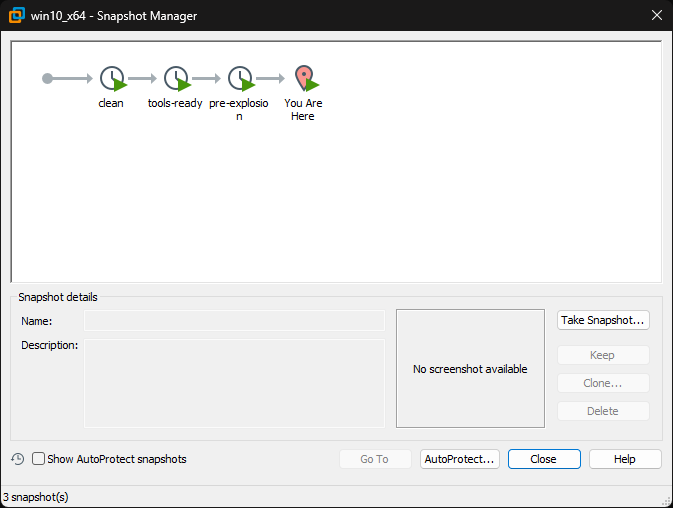
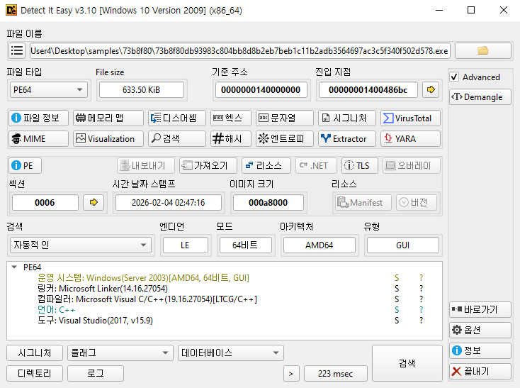
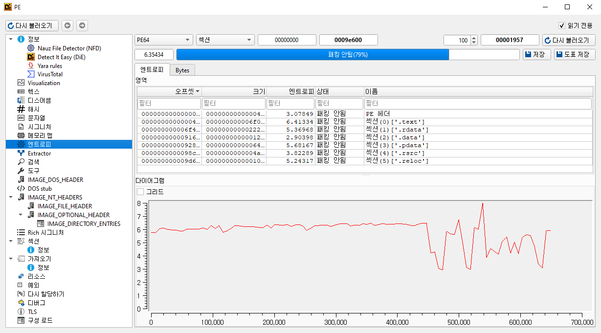
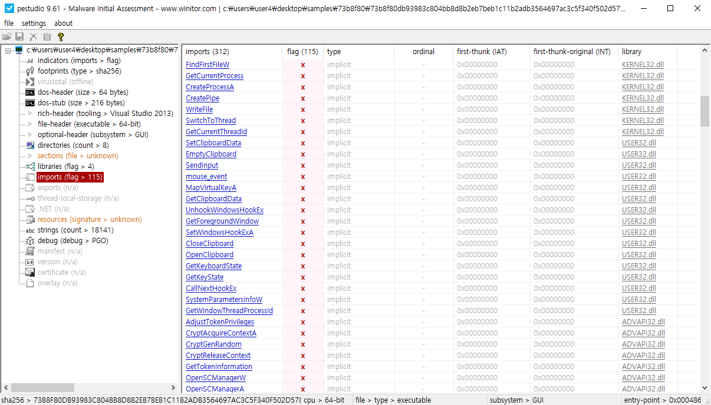
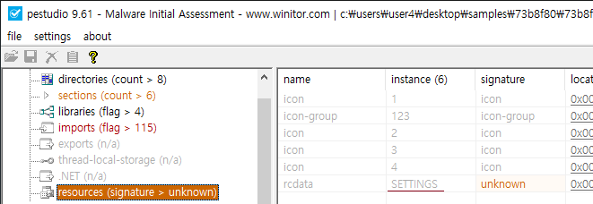
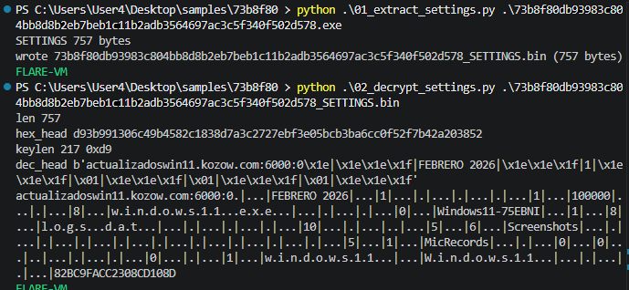
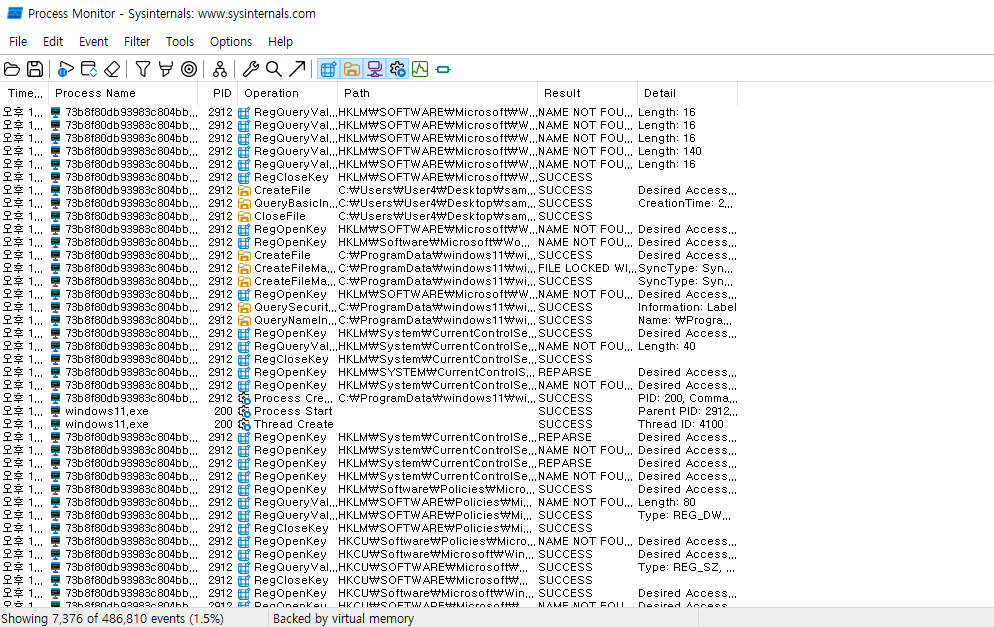
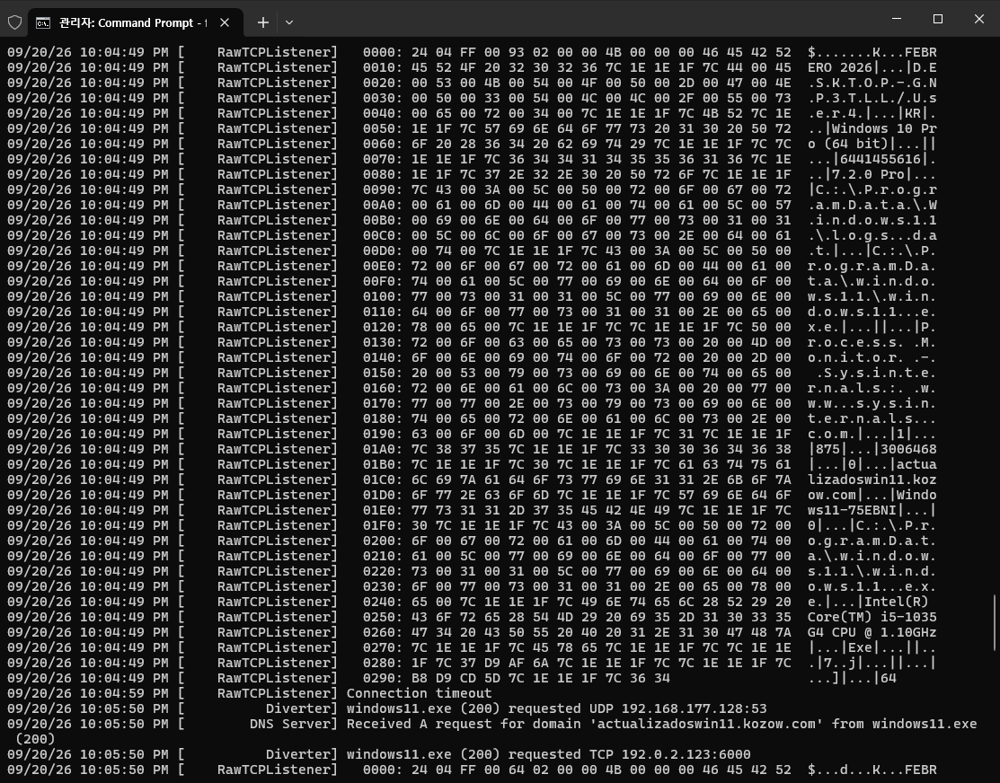

# Remcos 7.2.0 Pro 분석 보고서
- 분석일: 2026-09-20
- 환경: FLARE-VM Host-only
- 권한: 일반 사용자
- 저장소: https://github.com/lignah/remcos-72-analysis

샘플 SHA256: `73b8f80db93983c804bb8d8b2eb7beb1c11b2adb3564697ac3c5f340f502d578`

## 1. 요약
Remcos는 합법 원격관리로 판매되지만, 실제로는 초기 침투 이후 C2·지속성·정보수집에 반복 사용되는 RAT로, 본 샘플은 windows11 위장 드롭·kozow.com C2·캠페인 태그 FEBRERO 2026이 SETTINGS(RC4)와 동적 비콘에서 일치해, 설정 복호화만으로도 인텔리전스·탐지용 IOC를 바로 뽑을 수 있었음.

PE64 MSVC 빌드의 Remcos RAT(7.2.0 Pro). 패커 없음. C2와 캠페인 문자열은 PE 리소스 `RCDATA/SETTINGS`에 RC4로 들어 있음. 일반 사용자 권한으로 실행하면 `%ProgramData%\windows11\windows11.exe`로 자기복사한 뒤 `HKCU\...\Run`에 등록하고, `actualizadoswin11.kozow.com:6000`으로 비콘을 보냄. 분석은 Host-only + FakeNet에서만 수행했고 실제 C2에는 접속하지 않았음.

## 2. 랩
- 게스트: Windows 10 Pro x64, FLARE-VM, VMware Host-only
- 스냅샷: clean → tools-ready → pre-explosion
- 실행 권한: 일반 사용자(더블클릭)
- 네트워크: FakeNet-NG. 싱크홀 192.0.2.123:6000



## 3. 정적
- 크기 648704 bytes, PE64 GUI, MSVC 19.16 / VS2017, 서명 없음
- 전체 entropy 6.35, overlay 없음, EP 0x486BC
- 문자열: Remcos Agent initialized, watchdog, EnableLUA=0, Chrome/Firefox/Brave 경로, ip-api.com
- imports: `SetWindowsHookExA`, `GetClipboardData`, `WriteProcessMemory`, `socket/connect`, `InternetOpen`, `waveInOpen`
- capa: vivisect 단계에서 미완료. ATT&CK는 imports/문자열/동적으로 매핑






### SETTINGS (RCDATA, 757 bytes, entropy 7.734)
형식: `[keylen=0xD9][217바이트 키][RC4 암호문]`

엔트로피 7.734: `settings.bin`(757B)에 대한 Shannon entropy (직접 계산).

스크립트: `script/01_extract_settings.py`, `script/02_decrypt_settings.py`



```python
# script/02_decrypt_settings.py
klen = data[0]                    # 0xD9 → 217
key, enc = data[1:1+klen], data[1+klen:]
dec = rc4(key, enc)               # C2·캠페인·드롭명
```

복호화 결과:
- C2: actualizadoswin11.kozow.com:6000
- 캠페인 태그: FEBRERO 2026 (SETTINGS)
- 드롭명: windows11.exe
- ID: Windows11-75EBNI
- 아티팩트명: logs.dat, Screenshots, MicRecords

## 4. 동적 (약 90초)
부모 `73b8f80....exe` PID 2912:
1. `HKCU\Software\Windows11-75EBNI` 생성
2. `C:\ProgramData\windows11\windows11.exe` 기록 (648704 bytes)
3. `HKCU\Software\Microsoft\Windows\CurrentVersion\Run\Windows11-75EBNI` = `"C:\ProgramData\windows11\windows11.exe"`
4. 자식 PID 200 생성 후 부모 Exit 0

자식 `windows11.exe` PID 200:
- DNS: actualizadoswin11.kozow.com
- TCP: FakeNet 192.0.2.123:6000 (실 C2 아님)
- 비콘: Remcos 7.2.0 Pro, FEBRERO 2026, Windows11-75EBNI, 호스트명/OS/CPU
- `C:\ProgramData\windows11\logs.dat` (478 bytes)
- `HKCU\SOFTWARE\Windows11-75EBNI\licence=82BC9FACC2308CD108DF12FCE43C350C`
- HKLM Run / EnableLUA / Screenshots / MicRecords: 이번 런에서 미관찰




## 5. ATT&CK
| ID | 기법 | 근거 |
|---|---|---|
| T1036.005 | 정상 파일명 위장 | windows11.exe, ProgramData |
| T1547.001 | 레지스트리 Run | HKCU Run\Windows11-75EBNI |
| T1071.001 / T1095 | C2 | kozow.com:6000 TCP |
| T1082 | 시스템 정보 | 비콘 OS/CPU (동적); ip-api 문자열 (정적) |
| T1056.001 | 키로깅 | SetWindowsHookExA (정적) |
| T1115 | 클립보드 | GetClipboardData (정적) |
| T1123 | 오디오 | waveInOpen·MicRecords 경로 (정적); 이번 런 미관찰 |
| T1555.003 | 브라우저 자격증명 | Chrome/Firefox/Brave 경로 (정적) |
| T1562.001 / T1548.002 | 방어 무력화 | EnableLUA 문자열. 이번 런타임 미실행 |

## 6. IOC
```
SHA256  73b8f80db93983c804bb8d8b2eb7beb1c11b2adb3564697ac3c5f340f502d578
C2      actualizadoswin11.kozow.com:6000
ID      Windows11-75EBNI
Path    C:\ProgramData\windows11\windows11.exe
Path    C:\ProgramData\windows11\logs.dat
Reg     HKCU\...\Run\Windows11-75EBNI
Reg     HKCU\Software\Windows11-75EBNI
YARA    remcos.yar (Remcos_73b8f80_SETTINGS)
```

## 7. 한계
- capa 전체 매칭 실패(vivisect)
- 일반 사용자 런이라 HKLM/UAC 무력화는 미확인
- C2 명령(키로그 전송, 마이크)은 FakeNet 타임아웃으로 미전개
- 샘플·SETTINGS 원본은 저장소에 올리지 않음

## 8. 첨부
- `script/01_extract_settings.py`, `script/02_decrypt_settings.py`
- screenshots/01-die.png, 02-die-entropy.png, 03-pestudio-hooking.png
- screenshots/03a-pestudio-resources-settings.png, 03b-settings-extract-decrypt.png
- screenshots/04-snapshots.png, 05-procmon-install.png, 06-fakenet-beacon.png
- remcos.yar